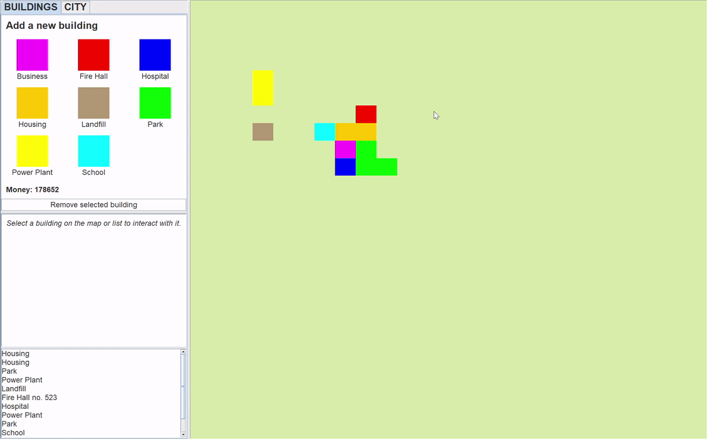
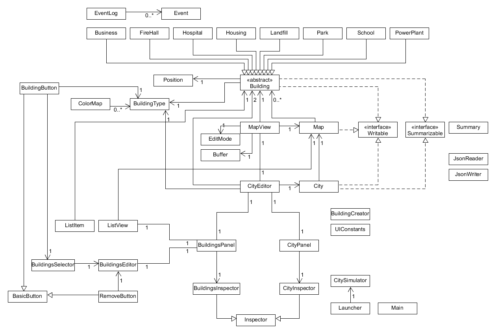

# Mini City

This program simulates a city. You can add and remove buildings of different
types, manage your city's finances, and view its statistics.

This application can be used by anyone who is interested in the idea of
building their own city and watching it grow, and who are interested in
simulation programs in general.

I am interested in this project because I've played city-building games
before and wanted to make my own, perhaps with some features that were 
missing from the ones I played.

## Features
- Create a new building of a certain type and add it to the city.
- View all the added buildings in the city, both in a textual list view and a graphical map view.
- Manage the finances of the city.
- View a summary of statistics/info about the city.
- Save and load city state to/from a JSON file.

## Structure
The following UML design diagram gives an overview of the internal structure of the application.

## Reflection
Reflections on the current design of the program (how to improve if given more time)
 - The main problem I have with the current design is how events are travelling through the hierarchy.
This is resulting in classes like CityEditor acting as a mediator between the other GUI classes. For example, let's say
we want to highlight a building on the map when it is selected on the list view. In this case, if an item is selected
in the ListView, then it needs to tell the BuildingsPanel, which tells the CityEditor, which then tells the MapView.
If we want to add another event/user interaction, then we would have to add another series of method calls going up to
the CityEditor. It would be a lot better if there was a way for the ListView to notify the MapView directly.
It would make the GUI components more independent and would also reduce coupling.
I think this could potentially be solved with an observer pattern, although it would also come with its own problem
of how to initialize the components with observers.
 - To add on to the previous point, making City or Map an observable class would probably help reduce coupling 
within classes in the UI package. At the very least, making some UI classes like MapView observable themselves would
reduce coupling within the UI. 
 - Adding more systems that interact with each other to the simulator would make it more interesting.
This program was originally developed for a school project, which came with a hard time constraint.
If I had more time, I would add more rules to make the simulation more interesting.
 - Refactoring city statistics out of City into a separate "CityStatistics" class would help improve cohesion.